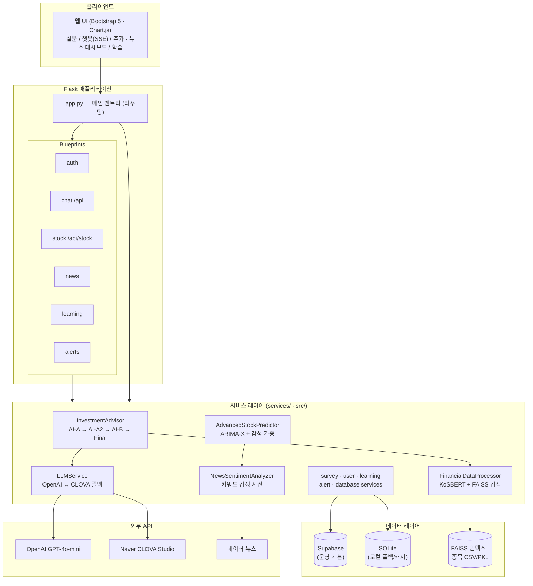

# Pixie — 개인화 AI 투자 어드바이저


**Pixie**는 투자 성향 설문으로 만든 개인 프로필을 바탕으로, 멀티에이전트 LLM 체인이 한국 주식 데이터·뉴스 감성 분석과 결합해 맞춤형 투자 상담을 제공하는 Flask 기반 웹 서비스입니다. 투자 초보자를 위한 교육 콘텐츠와 ARIMA-X 기반 주가 예측까지 하나의 서비스로 묶었습니다.

> 투자 판단의 최종 책임은 사용자에게 있으며, 본 서비스의 결과는 투자 권유가 아닌 참고 정보입니다.

## 계열 리포지토리

| 리포 | 설명 |
|---|---|
| **[pixie-](https://github.com/ll3i/pixie-)** (현재) | 최신 웹 서비스 버전 — Blueprint 구조 + Vercel 배포 |
| [pixie-investment](https://github.com/ll3i/pixie-investment) | 선행 웹 버전 |
| [InvestAI](https://github.com/ll3i/InvestAI) | 데스크톱 원형 (프로토타입) |
| [pixie](https://github.com/ll3i/pixie) | 정적 데모 (GitHub Pages) |
| [pixie-ai](https://github.com/ll3i/pixie-ai) | 아카이브 |

## 핵심 기능

### 1. 투자 성향 설문 → AI 프로필 분석
- 10개 문항 설문 응답을 LLM(`survey-score` 프롬프트)이 6개 지표로 점수화
  - 위험 감수성 · 투자 시간 범위 · 재무 목표 지향성 · 정보 처리 스타일 · 투자 두려움 · 투자 자신감
- `survey-analysis` 프롬프트가 지표 간 상호작용까지 반영한 상세 성향 분석(JSON) 생성
- 분석 결과는 프로필로 저장되어 이후 모든 AI 상담에 자동 주입

### 2. 멀티에이전트 LLM 체인 상담 (AI-A → AI-A2 → AI-B → Final)
`src/investment_advisor.py`의 `InvestmentAdvisor`가 고정된 4단계 체인을 오케스트레이션합니다.

- **AI-A**: 사용자 프로필 + 시장 컨텍스트를 반영한 초기 투자 조언
- **AI-A2**: AI-A 응답을 검토해 필요한 금융 데이터 분석 요청(쿼리)으로 정제
- **AI-B**: 주식 평가 데이터·시장 데이터를 근거로 정량 분석 수행
- **Final**: 에이전트 간 대화 히스토리를 종합해 최종 답변 합성
- SSE 스트리밍으로 각 에이전트의 진행 상태를 실시간 표시
- OpenAI(GPT-4o-mini) ↔ CLOVA Studio 간 자동 폴백, 실패 시 템플릿 응답까지 3단계 오류 복구

### 3. KoSBERT + FAISS 시맨틱 종목 검색
- `jhgan/ko-sbert-multitask` 한국어 문장 임베딩으로 종목 재무 요약 텍스트를 벡터화
- FAISS(`IndexFlatL2`) 인덱스로 자연어 질의와 유사한 종목 검색 (TF-IDF 검색 폴백 지원)
- 검색 결과에 PER·PBR·부채비율·평가점수 등 재무 지표 첨부

### 4. ARIMA-X + 뉴스 감성 가중 주가 예측
- `src/advanced_stock_predictor.py` — 뉴스 감성 점수를 외생변수(exog)로 쓰는 ARIMA-X 모델
- ADF 정상성 검정으로 차분 차수 자동 결정, 로그 변환으로 안정화
- 감성 영향력이 매일 5%씩 감쇠하는 시간 감쇠(decay) 조정 + 68%/95% 신뢰구간 산출
- MA20/MA60·RSI 등 기술적 지표와 결합한 매수/매도 시그널 생성 (실패 시 추세 기반 폴백)

### 5. 뉴스 수집·감성 분석
- 네이버 뉴스 기반 실시간 금융 뉴스 수집 및 키워드 사전 기반 감성 스코어링
- 시장 분위기(긍정/중립/부정) 요약, 트렌드 키워드 추출, 관심 종목 뉴스 필터링

### 6. 투자 교육 콘텐츠
- 카드뉴스 형식의 투자 기초 학습, 투자 용어 사전, 퀴즈와 학습 진도 관리

### 7. 포트폴리오 · 알림
- 관심 종목/포트폴리오 관리, 위험 알림(리스크 리포트) 및 알림 히스토리

## 아키텍처



DB 접근은 `src/db_client.py`의 이중 전략(dual strategy)을 따릅니다 — Supabase 환경변수가 설정되면 Supabase를 우선 사용하고, 없으면 SQLite로 동작합니다.

## 프로젝트 구조

```
pixie-/
├── app.py                  # 메인 Flask 앱 (전체 기능 엔트리포인트)
├── app_vercel.py           # Vercel 배포용 경량 버전 (샘플 데이터)
├── config.py               # 환경별 설정 (Development/Production/Testing)
├── blueprints/             # 기능별 Blueprint (auth·chat·news·stock·learning·alerts)
├── services/               # 서비스 레이어 (survey·user·learning·alert·database)
├── src/                    # 핵심 엔진
│   ├── investment_advisor.py       # 멀티에이전트 오케스트레이터
│   ├── llm_service.py              # LLM 호출·폴백·응답 검증
│   ├── advanced_stock_predictor.py # ARIMA-X + 감성 가중 예측
│   ├── financial_data_processor.py # KoSBERT + FAISS 벡터 검색
│   ├── stock_search_engine.py      # TF-IDF 종목 검색
│   ├── news_sentiment_analyzer.py  # 뉴스 감성 분석
│   ├── memory_manager.py           # 세션·에이전트 대화 메모리
│   └── prompt_AI-A / A2 / B.txt    # 에이전트별 프롬프트
├── templates/              # Jinja2 템플릿
├── static/                 # CSS/JS/이미지
├── data/                   # 한국 주식 시세·재무·평가 데이터 (CSV/PKL)
└── vercel.json             # Vercel 배포 설정
```

## 설치 및 실행

### 1. 클론 및 가상환경

```bash
git clone https://github.com/ll3i/pixie-.git
cd pixie-
python -m venv venv
venv\Scripts\activate      # Windows
source venv/bin/activate   # macOS/Linux
```

### 2. 의존성 설치

```bash
pip install -r requirements.txt
```

`requirements.txt`는 경량 배포(Vercel) 기준입니다. 주가 예측·시맨틱 검색·Supabase 등 전체 기능을 로컬에서 쓰려면 추가 설치가 필요합니다.

```bash
pip install pandas numpy statsmodels scikit-learn sentence-transformers faiss-cpu supabase python-dateutil
```

### 3. 환경변수 설정

`.env.example`을 복사해 `.env`를 만들고 값을 채웁니다.

```bash
cp .env.example .env
```

| 변수 | 필수 | 설명 |
|---|---|---|
| `OPENAI_API_KEY` | 필수 | OpenAI API 키 (AI 상담·설문 분석) |
| `FLASK_SECRET_KEY` | 필수 | Flask 세션 서명 키 (32자 이상 무작위 문자열) |
| `CLOVA_API_KEY` | 선택 | CLOVA Studio 키 (OpenAI 장애 시 폴백) |
| `SUPABASE_URL` / `SUPABASE_KEY` | 선택 | 미설정 시 SQLite로 동작 |
| `FLASK_ENV` | 선택 | `development` / `production` |

> API 키는 반드시 환경변수로만 관리하고, `.env`는 절대 커밋하지 마세요 (`.gitignore`에 포함되어 있습니다).

### 4. 실행

```bash
python app.py
```

브라우저에서 `http://localhost:5000` 접속.

## 주요 페이지

| 경로 | 기능 |
|---|---|
| `/` | 메인 대시보드 |
| `/survey` | 투자 성향 설문 → AI 프로필 분석 |
| `/chatbot` | 멀티에이전트 AI 투자 상담 (스트리밍) |
| `/stock` | 종목 조회·ARIMA-X 주가 예측 |
| `/news` | 금융 뉴스·감성 분석·트렌드 키워드 |
| `/learning` | 카드뉴스·용어사전·퀴즈 |
| `/my-invest` | 포트폴리오·관심 종목 관리 |
| `/alerts` | 위험 알림·알림 히스토리 |

## 배포

### Vercel
`vercel.json`이 경량 버전(`app_vercel.py`)을 서빙하도록 구성되어 있습니다.

```bash
npm i -g vercel
vercel          # 프리뷰 배포
vercel --prod   # 프로덕션 배포
```

환경변수는 Vercel 대시보드(Project → Settings → Environment Variables)에 등록하세요.

## 라이선스

MIT License

## 기여 및 문의

버그 제보·기능 제안은 [Issues](https://github.com/ll3i/pixie-/issues)로, 개선 사항은 Pull Request로 보내주세요.
